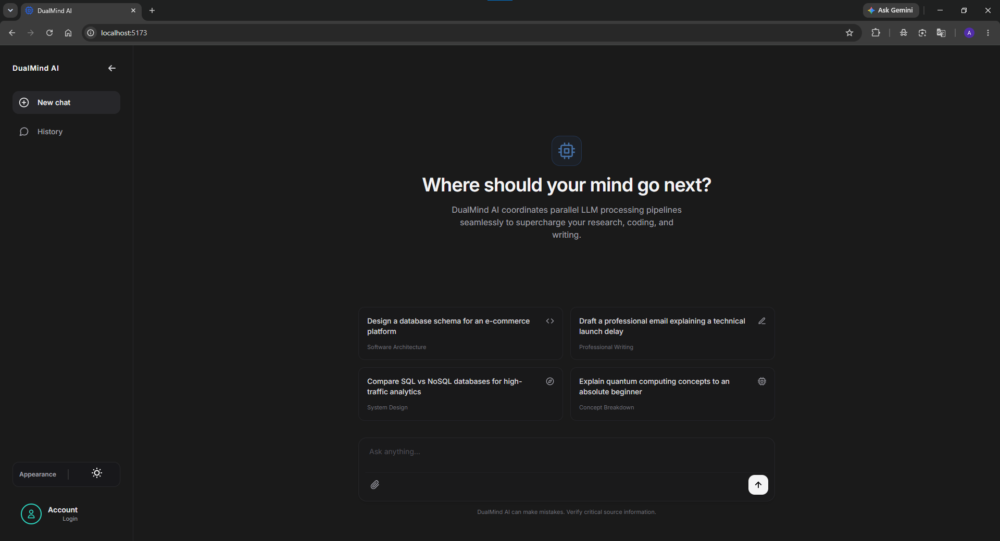
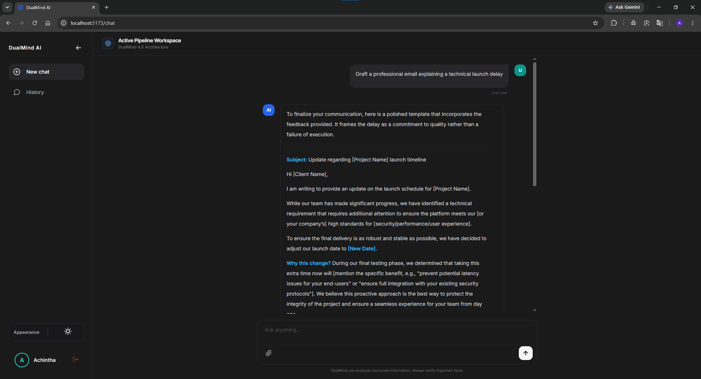
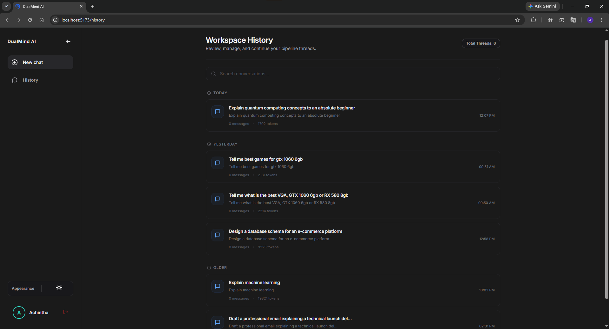
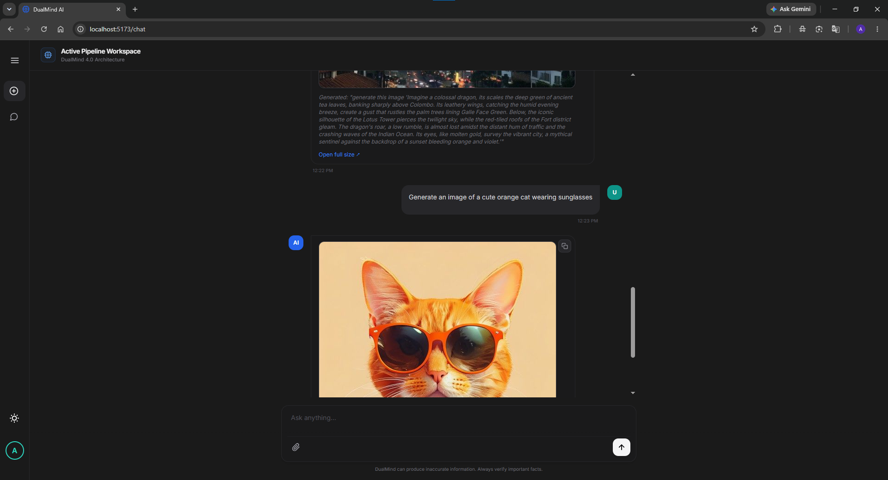

# DualMind AI 🧠


> *Not one AI. Three — working together.*

DualMind AI is a multi-agent reasoning system where every question is answered by a pipeline of three specialized AI agents that analyze, challenge, and refine responses before you ever see them. The result is a measurably more accurate, balanced, and thoughtful answer than any single model can produce alone.

## Why DualMind?

Most AI chat applications rely on a single model response.

DualMind introduces a collaborative reasoning approach where multiple AI agents work together before producing the final answer.

- Analyst generates the initial response.
- Critic identifies weaknesses and missing details.
- Judge combines the strongest ideas into a refined answer.

This process helps reduce hallucinations, improve answer quality, and provide more balanced responses.

## What Makes DualMind Different?

Unlike traditional AI chatbots that rely on a single model response, DualMind uses a collaborative multi-agent workflow:

1. Analyst researches and drafts.
2. Critic challenges and improves.
3. Judge synthesizes the final answer.

This approach encourages deeper reasoning, improved accuracy, and more balanced responses.

## Live Demo
Check out the deployed application here: [DualMind AI Live](https://dual-mind-ai-kappa.vercel.app)
---

## Screenshots

### Home Page


### Chat Interface


### Conversation History


### Image Generation


---

## Key Highlights

- Multi-agent AI reasoning architecture
- Persistent conversation memory
- AI image generation
- JWT + Google OAuth authentication
- Responsive mobile-first UI
- Markdown rendering with code highlighting
- MongoDB conversation storage
- Gemini model fallback system

---

## Conversation Context

Unlike many simple AI chat applications, DualMind maintains conversation history and automatically provides relevant previous messages to the AI pipeline.

This allows users to ask follow-up questions naturally without repeating the original topic.

### Example

**User:**
> What is TCP?

**AI:**
> TCP is a reliable transport protocol that ensures data arrives correctly and in order.

**User:**
> Explain it like I'm 10 years old.

**AI:**
> Imagine TCP is like a careful delivery person who makes sure every package arrives safely and in the correct order.

The AI understands that "it" refers to TCP because the conversation history is preserved and used as context.

## Architecture

```
Your Question
      │
      ▼
┌─────────────────────────────────────────────┐
│  ANALYST                                    │
│  Reads the question, researches context,    │
│  and drafts an initial answer.              │
└─────────────────────────────────────────────┘
      │
      ▼
┌─────────────────────────────────────────────┐
│  CRITIC                                     │
│  Reviews the Analyst's draft, identifies    │
│  gaps, errors, and weak reasoning.          │
└─────────────────────────────────────────────┘
      │
      ▼
┌─────────────────────────────────────────────┐
│  JUDGE                                      │
│  Weighs both outputs, resolves conflicts,   │
│  and writes the final polished answer.      │
└─────────────────────────────────────────────┘
      │
      ▼
  Final Answer ✅
```

---

## Features

| Feature | Description |
|---|---|
| 🤖 Multi-agent pipeline | Analyst → Critic → Judge architecture |
| 💬 Chat interface | Clean, streaming-ready chat UI |
| 🖼️ Image generation | AI image generation via Pollinations AI |
| 🔐 Authentication | JWT-based auth + Google Sign-In (OAuth2) |
| 📜 Conversation history & context memory | Stores conversation history in MongoDB and uses previous messages to answer follow-up questions with context awareness.|
| 📝 Rich markdown | Full markdown with syntax-highlighted code blocks |
| 🌗 Dark / Light mode | System-aware theme toggle |
| 📱 Responsive | Optimized for desktop and mobile |
| 🛡️ Security | Helmet, rate limiting, bcrypt, Zod validation |

---

## Tech Stack

### Frontend
- **React** + **Vite**
- **React Router v7**
- **Axios**
- **Tailwind CSS**
- **React Markdown** + **React Syntax Highlighter**
- **@react-oauth/google**
- **React Hot Toast**
- **React Icons**

### Backend
- **Node.js** + **Express.js**
- **MongoDB** + **Mongoose**
- **JWT** (jsonwebtoken)
- **Google OAuth2** (google-auth-library)
- **Zod** validation
- **bcrypt**
- **Helmet** + **CORS**

### AI
- **Google Gemini API** — `gemini-2.5-flash-lite` (primary), with automatic fallback to `gemini-2.5-flash`
- **Pollinations AI** — Free image generation, no API key required

---

## Project Structure

```
DualMind-AI/
├── client/                        # React frontend (Vite)
│   ├── src/
│   │   ├── api/                   # Axios API clients
│   │   │   ├── axios.js
│   │   │   ├── authApi.js
│   │   │   ├── chatApi.js
│   │   │   ├── historyApi.js
│   │   │   └── imageApi.js
│   │   ├── components/            # Reusable UI components
│   │   │   ├── ChatInput.jsx
│   │   │   ├── ChatMarkdown.jsx
│   │   │   ├── Drawer.jsx
│   │   │   ├── LoginAvatar.jsx
│   │   │   ├── MessageBody.jsx
│   │   │   └── ThemeToggle.jsx
│   │   ├── context/               # React context providers
│   │   │   ├── AuthProvider.jsx
│   │   │   └── ThemeProvider.jsx
│   │   ├── hooks/                 # Custom hooks
│   │   │   ├── useAuth.js
│   │   │   └── useTheme.js
│   │   ├── pages/                 # Route-level pages
│   │   │   ├── ChatPage.jsx
│   │   │   ├── HistoryPage.jsx
│   │   │   ├── HomePage.jsx
│   │   │   ├── LoginPage.jsx
│   │   │   └── RegisterPage.jsx
│   │   └── routes/
│   │       └── AppRoutes.jsx
│   └── .env                       # VITE_API_URL, VITE_GOOGLE_CLIENT_ID
│
├── server/                        # Express backend
│   ├── src/
│   │   ├── agents/                # AI agent implementations
│   │   │   ├── analyst.js
│   │   │   ├── critic.js
│   │   │   └── judge.js
│   │   ├── config/
│   │   │   ├── config_index.js
│   │   │   └── db.js
│   │   ├── controllers/
│   │   │   ├── authController.js
│   │   │   ├── chatController.js
│   │   │   ├── historyController.js
│   │   │   └── imageController.js
│   │   ├── middleware/
│   │   │   └── authenticate.js
│   │   ├── models/
│   │   │   ├── conversation.js
│   │   │   └── user.js
│   │   ├── orchestration/
│   │   │   └── orchestrator.js
│   │   ├── prompts/
│   │   │   └── prompt_index.js
│   │   ├── providers/
│   │   │   └── gemini.js
│   │   ├── routes/
│   │   │   ├── authRoutes.js
│   │   │   ├── chatRoutes.js
│   │   │   ├── historyRoutes.js
│   │   │   └── imageRoutes.js
│   │   ├── services/
│   │   │   ├── authService.js
│   │   │   ├── chatService.js
│   │   │   ├── historyService.js
│   │   │   └── imageService.js
│   │   └── utils/
│   │       ├── errorHandler.js
│   │       └── rateLimiter.js
│   └── .env                       # PORT, MONGODB_URI, JWT_SECRET, GEMINI_API_KEY, GOOGLE_CLIENT_ID
│
└── screenshots/
```

---


## Installation & Setup

### Prerequisites
- Node.js v18+
- MongoDB (local or [MongoDB Atlas](https://www.mongodb.com/atlas))
- Google Gemini API key — [Get one free](https://aistudio.google.com/apikey)
- Google OAuth Client ID — [Create one](https://console.cloud.google.com/apis/credentials)

### 1. Clone the repository

```bash
git clone https://github.com/Achintha-Dev/DualMind-AI.git
cd DualMind-AI
```

### 2. Backend setup

```bash
cd server
npm install
```

Create `server/.env`:

```env
PORT=5000
NODE_ENV=development
MONGODB_URI=your_mongodb_connection_string
JWT_SECRET=your_strong_jwt_secret_here
JWT_EXPIRES_IN=7d
GEMINI_API_KEY=your_gemini_api_key
GOOGLE_CLIENT_ID=your_google_oauth_client_id
CLIENT_URL=http://localhost:5173
```

| Variable | Description |
|-----------|------------|
| PORT | Server port |
| MONGODB_URI | MongoDB connection string |
| JWT_SECRET | JWT signing secret |
| GEMINI_API_KEY | Gemini API key |
| GOOGLE_CLIENT_ID | Google OAuth client ID |
| CLIENT_URL | Frontend URL |


Start the backend:

```bash
npm run dev
```

### 3. Frontend setup

```bash
cd client
npm install
```

Create `client/.env`:

```env
VITE_API_URL=http://localhost:5000/api
VITE_GOOGLE_CLIENT_ID=your_google_oauth_client_id
```

| Variable | Description |
|-----------|------------|
| VITE_API_URL | Backend API URL |
| VITE_GOOGLE_CLIENT_ID | Google OAuth client ID |

Start the frontend:

```bash
npm run dev
```

Visit **http://localhost:5173**


## Deployment

### Frontend
Deploy the React application using:

- Vercel
- Netlify

### Backend
Deploy the Express API using:

- Render
- Railway
- VPS

### Database
Use MongoDB Atlas for production.


## Example Conversation

### User

What is TCP?

### Analyst

TCP is a transport layer protocol that provides reliable communication.

### Critic

The answer should explain reliability mechanisms such as acknowledgements and retransmissions.

### Judge

TCP is like a reliable delivery service. It breaks data into pieces, numbers them, checks that each piece arrives safely, and resends any missing pieces.


---

## API Reference

### Authentication
| Method | Endpoint | Description | Auth Required |
|---|---|---|---|
| POST | `/api/auth/register` | Register new user | No |
| POST | `/api/auth/login` | Login with email/password | No |
| POST | `/api/auth/google` | Login with Google OAuth | No |
| GET | `/api/auth/me` | Get current user | Yes |
| POST | `/api/auth/logout` | Logout | Yes |

### Chat
| Method | Endpoint | Description | Auth Required |
|---|---|---|---|
| POST | `/api/chat/ask` | Send a question through the agent pipeline | Optional |

### History
| Method | Endpoint | Description | Auth Required |
|---|---|---|---|
| GET | `/api/history` | Get all conversations | Yes |
| GET | `/api/history/:id` | Get a single conversation | Yes |
| DELETE | `/api/history/:id` | Delete a conversation | Yes |
| DELETE | `/api/history` | Delete all conversations | Yes |

### Image
| Method | Endpoint | Description | Auth Required |
|---|---|---|---|
| GET | `/api/image/proxy` | Proxy image generation request | No |

---

## Security

- **JWT Authentication** with configurable expiry
- **Password hashing** with bcrypt
- **Input validation** with Zod on all endpoints
- **Rate limiting** — 20 requests per 15-minute window per IP
- **Helmet** security headers
- **CORS** configured to allow only the client origin
- **Environment variables** for all secrets — never hardcoded

---

## Gemini Model Configuration

DualMind uses automatic model fallback. If the primary model hits a quota limit, it tries the next one:

```
Primary:  gemini-2.5-flash-lite  →  1,000 req/day free
Fallback: gemini-2.5-flash       →  250 req/day free
```

> **Note:** `gemini-2.0-flash` models were deprecated by Google in February 2026 and retired March 3, 2026. Always use `2.5-*` models.

---

## Future Improvements

- [ ] Streaming AI responses (token-by-token rendering)
- [ ] Voice input and text-to-speech output
- [ ] Conversation search and filtering
- [ ] Export conversations as PDF or Markdown
- [ ] Multiple AI provider support (OpenAI, Anthropic)
- [ ] Shared / public conversation links
- [ ] Image editing and variation capabilities
- [ ] Agent trace view (show Analyst → Critic → Judge steps)
- [ ] Custom system prompt configuration per conversation

---

## Acknowledgements

- Google Gemini API
- Pollinations AI
- MongoDB Atlas
- React
- Tailwind CSS
- Express.js

---

## Author

**Achintha Bandara**
GitHub: [Achintha-Dev](https://github.com/Achintha-Dev)

---

## Contributing

Contributions, issues, and feature requests are welcome.

1. Fork the repository
2. Create a feature branch
3. Commit your changes
4. Push to your fork
5. Open a Pull Request

---
## License

This project is licensed under the [MIT License](LICENSE).